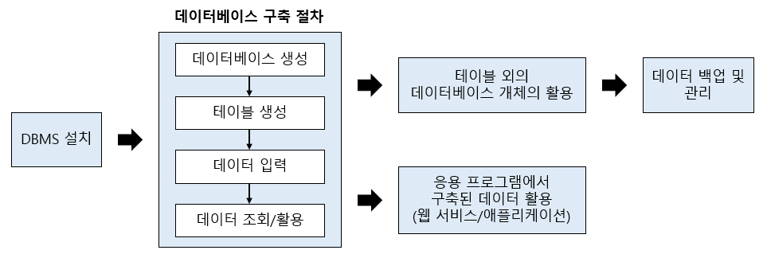

# Part 1 MySQL 설치 및 DB 구축과정 미리 실습하기

## CH 2. MySQL 전체 운영 실습

### 1. 요구사항 분석과 시스템 설계 그리고 모델링

#### 1-1 정보시스템 구축 절차 요약

1. 분석
   - 현재 우리가 무엇을(What) 할 것인지 결정
2. 설계
   - 우리가 구축하고자 하는 시스템을 어떻게(How) 할 것인지 결정
3. 구현
4. 테스트
5. 유지보수

- 대부분의 프로젝트에서 분석 및 설계의 과정이 전체 50% 이상 차지

#### 1-2 데이터베이스 모델링과 필수 용어

- 데이터베이스 모델링이란 현실세계에서 사용되는 데이터를 MySQL에 어떻게 옮겨 놓을 것인지를 결정하는 과정

##### 용어

- 데이터: 단편적인 정보, 정보는 있으나 아직 체계화되지 못한 상태
- 테이블: 데이터를 입력하기 위해 표 형태로 표현한 것
- 데이터베이스: 테이블이 저장되는 저장소
- DBMS: 데이터베이스를 관리하는 시스템 또는 소프트웨어
- 열(=컬럼=필드): 각 테이블은 열로 구성
- 열 이름: 열의 데이터 형식으로 테이블 생성할 때 열 이름과 함께 지정해야 함
- 행(=로우=레코드): 실질적인 데이터
- 기본 키(Primary Key) 열: 각 행을 구분하는 유일한 열로 중복되어 있어서는 안되며 비어 있어서도 안되고, 각 테이블엔 기본 키가 하나만 지정되어 있어야 함
- 외래 키(Foreign Key) 필드: 두 테이블의 관계를 맺어주는 키

### 2. MySQL을 이용한 데이터베이스 구축 절차

### 3. 테이블 외의 데이터베이스 개체의 활용

#### 3-1 인덱스

    인덱스란 책의 제일 뒤에 붙어있는 찾아보기와 같은 개념이다. 실습하는 데이터들은 양이 몇건 되지 않아 인덱스가 없어도 별 문제가 되지 않지만, 실무에서는 수천~수억 건 이상의 데이터에서 인덱스가 없이 전체 데이터를 찾아보는 것은 부담스러운 일이다.

    데이터베이스 튜닝이란 데이터베이스 성능을 향상시키거나 응답하는 시간을 단축시키는 것을 말한다. 이를 위해 집중적으로 확인하는 부분 중 하나가 인덱스 부분이다.

    인덱스는 테이블의 열 단위에 생성되며, 열을 기본 키로 설정하면 자동으로 인덱스가 생성된다.

#### 3-2 뷰

    뷰란 가상의 테이블이다. 사용자 입장에서는 테이블과 동일하게 보이지만 뷰는 실제 행 데이터를 가지고 있지 않다. 진짜 테이블에 링크(Link)된 개념이다.

#### 3-3 스토어드 프로시저

    스토어드 프로시저(Stored Procedure)란 MySQL에서 제공해주는 프로그래밍 기능을 말한다. 즉, SQL 문을 하나로 묶어서 편리하게 사용하는 기능이다. 실무에서는 SQL 문을 매번 수행하기보다는 스토어드 프로시저로 만들어 놓은 후에 스토어드 프로시저를 호출하는 방식을 많이 사용한다.

#### 3-4 트리거

    트리거(Trigger)란 테이블에 부착되어서 테이블에 INSERT나 UPDATE, DELETE 작업이 발생되면 실행되는 코드를 말한다.

### 4. 데이터베이스 백업 및 관리

    백업은 현재의 데이터베이스를 다른 매체에 보관하는 작업을 말하며 복원은 데이터베이스에 문제가 발생 시에 다른 매체에 백업된 데이터를 이용해서 원상태로 돌려놓는 작업을 말한다.

