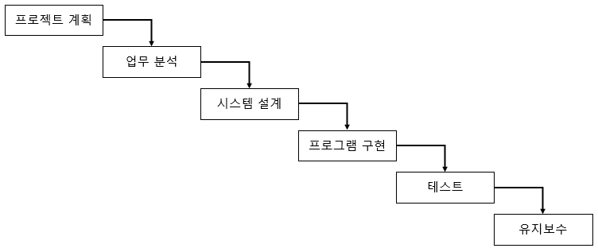

# Part 2 MySQL 기본

## CH 1. 데이터베이스 기본

### 1. 프로젝트의 진행 단계

#### 1-1 프로젝트의 진행 단계

- 프로젝트란 현실 세계의 업무를 컴퓨터 시스템으로 옮겨놓는 일련의 과정

    소프트웨어 분야에서는 아직도 큰 규모의 프로그램 작업 수행 시에도 몇몇 우수한 프로그래머에게 의존하는 형태를 취한다. 그 결과 프로젝트가 참담한 실패로 이어지는 경우가 많았고, 제작 기간의 지연 등 많은 문제가 있었다.

    어떤 프로그램을 작성해 달라고 요청하면 계획하고 분석을 하기보다는 코딩하는 습관에 길들여져 있다. 그래서 열심히 프로그램을 짠 결과가 결국 잘못되어 프로그램을 삭제하고 처음부터 다시 짜야 하는 상황이 많이 발생했다. 그 원인은 분석과 설계 작업을 등한시하는 소프트웨어 분야의 고질적인 문제점이었다. 결론적으로 이러한 문제점을 해결하기 위해서 소프트웨어 개발 방법론이 나타났다.

##### 폭포수 모델(Waterfall Model)

- 가장 오래되고 전통적으로 사용되는 모델
- 폭포가 떨어지듯 각 단계가 끝나면 다음 단계로 진행
- 각 단계가 명확히 구분되어 프로젝트의 진행 단계가 명확해짐
- 문제가 발생될 경우 다시 앞 단계로 거슬러 올라가기가 어려움
  - 보통 문제는 초기 단계보다 구현 또는 테스트 단계에서 나옴
- 핵심적인 단계는 업무 분석과 시스템 설계
  - 전체 공정의 50% 이상을 할당해야 하며, 이 두 단계의 비율을 줄일수록 프로젝트가 실패할 확률이 높아짐

### 2. 데이터베이스 모델링

- 데이터베이스 모델링이란 현 세계에서 사용되는 작업이나 사물들을 DBMS의 데이터베이스 개체로 옮기기 위한 과정
- 구현하고자 하는 업무에 대한 폭넓고 정확한 지식이 필요하고 데이터베이스 시스템에 대한 깊은 지식과 경험이 요구
- 데이터베이스 모델링 3단계
  - 개념적 모델링: 업무 분석 단계에 포함
  - 논리적 모델링: 업무 분석 후반부와 시스템 설계 전반부에 진행
  - 물리적 모델링: 시스템 설계의 후반부에 진행
